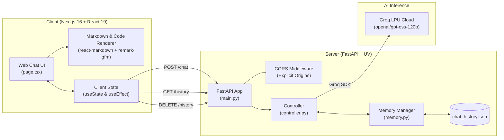

# 🌐 Modern Full-Stack AI Web Chatbot (Nova AI)

A modern, production-grade conversational AI web application built with **FastAPI**, **Next.js 16 (App Router)**, **React 19**, **Tailwind CSS v4**, and the ultra-low latency **Groq LPU Inference Engine**.

This project represents Stage 2 of the AI Learning Lab, evolving from a simple command-line chatbot ([`01-cli-chatbot`](../01-cli-chatbot/)) into a full-stack, responsive, and persistent web application.

---

## 📑 Table of Contents

- [Overview](#-overview)
- [Key Features](#-key-features)
- [System Architecture](#-system-architecture)
- [Tech Stack](#-tech-stack)
- [Project Structure](#-project-structure)
- [API Reference](#-api-reference)
- [Getting Started](#-getting-started)
  - [Prerequisites](#prerequisites)
  - [1. Backend Setup (FastAPI + UV)](#1-backend-setup-fastapi--uv)
  - [2. Frontend Setup (Next.js + PNPM)](#2-frontend-setup-nextjs--pnpm)
- [Environment Variables](#-environment-variables)
- [Cloud Deployment (Render & Vercel)](#-cloud-deployment-render--vercel)
- [Key Engineering Concepts & Learnings](#-key-engineering-concepts--learnings)
- [Contributing & License](#-author--license)

---

## 🌟 Overview

The **Web Chatbot** bridges modern web architecture with state-of-the-art open-weights LLMs:

- **Backend**: Built with **FastAPI** using `uv` for lightning-fast package management, strict Pydantic validation, explicit CORS configuration, and local persistent chat memory.
- **Frontend**: Built with **Next.js 16**, **React 19**, and **Tailwind CSS v4**, featuring an electric dark glassmorphic design system, real-time response stopwatch, animated typing feedback, and GitHub-Flavored Markdown (GFM) rendering with code copy controls.
- **Inference**: Powered by **Groq Cloud LPUs** (Language Processing Units), achieving instantaneous token generation using `openai/gpt-oss-120b`.

---

## ✨ Key Features

### 🖥️ Modern Web Experience

- **Dark Glassmorphic UI**: Translucent layered cards, glowing gradient accents, custom thin scrollbars, and fluid micro-animations.
- **Empty State Hero & Prompt Starters**: Instant prompt suggestion cards (_LPU Architecture_, _FastAPI Best Practices_, _AI Portfolio Ideas_, _Memory Design_) to spark conversations.
- **Stopwatch & Thinking Indicator**: Real-time elapsed response counter with synchronized 3-dot bouncing animation while the model generates.
- **Ergonomic Auto-Resizing Input**: Textarea automatically expands as you type, supporting `Enter` to submit and `Shift + Enter` for multi-line drafting.
- **Quick Action Controls**:
  - One-click **Copy Response** with live checkmark feedback.
  - Floating **Scroll to Bottom** button when browsing earlier context.
  - Global **Clear Chat** action synchronized across frontend and server storage.
- **Server Health Ping**: Real-time badge in the navbar indicating backend status (_Online / Connecting / Offline_).

### 📝 Rich Markdown & Code Support

- Powered by `react-markdown` and `remark-gfm`.
- **Fenced Code Blocks**: Formatted with custom language badges and an inline **Copy Code** button.
- **Rich Elements**: Bold, italics, blockquotes, ordered/unordered lists, dividers, and responsive tables.

### 🧠 Persistent Sliding-Window Memory

- Conversation history is automatically persisted to [`chat_history.json`](src/web_chatbot/data/chat_history.json).
- Applies a **sliding memory window** (retaining recent conversational turns) to balance deep context with LLM token budgets.
- Protected against file corruption or empty state crashes with robust JSON validation.

### ⚡ Robust Backend & Security

- Strict **Pydantic schema validation** on all request and response bodies.
- Explicit **CORS middleware** configured to prevent unauthorized cross-origin requests while ensuring smooth local Next.js communication.
- Automated OpenAPI specification and interactive Swagger UI at `/docs`.

---

## 🏗️ System Architecture



---

## 🛠️ Tech Stack

### Frontend

- **Framework**: Next.js 16 (App Router)
- **Library**: React 19
- **Styling**: Tailwind CSS v4 & Vanilla CSS animations
- **Markdown**: `react-markdown` & `remark-gfm`
- **Package Manager**: `pnpm`
- **Language**: TypeScript

### Backend

- **Framework**: FastAPI (Standard)
- **Validation**: Pydantic v2
- **LLM Client**: `groq` Python SDK
- **Environment**: `python-dotenv`
- **Package & Project Manager**: `uv`
- **Language**: Python 3.11+

---

## 📂 Project Structure

```text
02-web-chatbot/
├── .env.example                     # Environment template for backend API
├── .python-version                  # Pinned Python version (3.11+)
├── pyproject.toml                   # UV project definition & dependencies
├── README.md                        # Project documentation
├── uv.lock                          # Deterministic Python lockfile
├── src/
│   └── web_chatbot/
│       ├── __init__.py              # Package marker
│       ├── main.py                  # FastAPI application entrypoint & routing
│       ├── chatbot/
│       │   ├── controller.py        # Chatbot orchestration (load -> prompt -> LLM -> save)
│       │   ├── llm_client.py        # Groq client wrapper with fallback model handling
│       │   └── memory.py            # Chat history persistence & sliding-window trimmer
│       └── data/
│           └── chat_history.json    # Local conversational JSON storage
└── frontend/
    ├── package.json                 # Next.js scripts & npm dependencies
    ├── pnpm-lock.yaml               # Deterministic pnpm dependency lockfile
    ├── tsconfig.json                # TypeScript configuration
    ├── next.config.ts               # Next.js configuration
    ├── postcss.config.mjs           # PostCSS configuration for Tailwind v4
    ├── app/
    │   ├── layout.tsx               # Root HTML shell, fonts, and dark theme metadata
    │   ├── globals.css              # Custom scrollbars, glow effects & keyframe animations
    │   ├── page.tsx                 # Core interactive chatbot client component
    │   └── favicon.ico              # Browser icon
    └── public/                      # Static assets & icons
```

---

## 🔌 API Reference

The FastAPI backend runs on `http://127.0.0.1:8000` by default. You can inspect and test the interactive OpenAPI documentation at `http://127.0.0.1:8000/docs`.

### 1. Health Check

- **Endpoint**: `GET /`
- **Description**: Verifies that the API server is active and reachable.
- **Response** (`200 OK`):
  ```json
  {
    "status": "ok",
    "message": "AI Chatbot API is operational"
  }
  ```

### 2. Send Message

- **Endpoint**: `POST /chat`
- **Description**: Sends a user message, loads context history, invokes Groq LLM inference, appends the turn, trims history, and returns the assistant answer.
- **Request Body**:
  ```json
  {
    "message": "Explain quantum computing in one sentence."
  }
  ```
- **Response** (`200 OK`):
  ```json
  {
    "response": "Quantum computing harnesses the principles of superposition and entanglement to perform complex calculations exponentially faster than classical computers."
  }
  ```

### 3. Retrieve Conversation History

- **Endpoint**: `GET /history`
- **Description**: Returns all stored conversation turns from the local database.
- **Response** (`200 OK`):
  ```json
  {
    "history": [
      {
        "role": "user",
        "content": "Hello!"
      },
      {
        "role": "assistant",
        "content": "Hi there! How can I assist you today?"
      }
    ]
  }
  ```

### 4. Clear Conversation History

- **Endpoint**: `DELETE /history`
- **Description**: Clears all conversation turns from the server's persistent JSON store.
- **Response** (`200 OK`):
  ```json
  {
    "status": "cleared",
    "history": []
  }
  ```

---

## 🚀 Getting Started

Follow these steps to run both the FastAPI backend and Next.js frontend locally.

### Prerequisites

Ensure you have the following installed:

- [Python 3.11+](https://www.python.org/downloads/)
- [`uv`](https://docs.astral.sh/uv/) (Fast Python package manager)
- [Node.js 18+](https://nodejs.org/) and [`pnpm`](https://pnpm.io/)
- A free [Groq Cloud API Key](https://console.groq.com/keys)

---

### 1. Backend Setup (FastAPI + UV)

1. Open your terminal and navigate to the backend directory:

   ```bash
   cd 02-web-chatbot
   ```

2. Create your `.env` file from the provided example:

   ```bash
   cp .env.example .env
   ```

3. Open `.env` and add your Groq API key:

   ```env
   GROQ_API_KEY=gsk_your_actual_groq_api_key_here
   GROQ_MODEL=openai/gpt-oss-120b
   ```

4. Install dependencies using `uv`:

   ```bash
   uv sync
   ```

5. Start the FastAPI development server:
   ```bash
   uv run fastapi dev
   ```
   _The backend will start at `http://127.0.0.1:8000` with auto-reload enabled._

---

### 2. Frontend Setup (Next.js + PNPM)

1. Open a new terminal window and navigate to the frontend directory:

   ```bash
   cd 02-web-chatbot/frontend
   ```

2. Install node dependencies:

   ```bash
   pnpm install
   ```

3. Start the Next.js development server:

   ```bash
   pnpm run dev
   ```

   _The web client will be available at `http://localhost:3000`._

4. Open your browser and navigate to **[http://localhost:3000](http://localhost:3000)** to interact with your AI assistant!

---

## ⚙️ Environment Variables

### Backend Configuration (`02-web-chatbot/.env`)

| Variable       | Required | Default               | Description                                  |
| :------------- | :------: | :-------------------- | :------------------------------------------- |
| `GROQ_API_KEY` | **Yes**  | _None_                | Your Groq Cloud API Secret Key.              |
| `GROQ_MODEL`   |    No    | `openai/gpt-oss-120b` | Supported chat model ID hosted on Groq LPUs. |

#### Supported Groq Chat Models

- `openai/gpt-oss-120b` _(Recommended)_: Flagship intelligence and reasoning at LPU speeds.
- `openai/gpt-oss-20b`: Lightweight, extremely fast open-weights model.
- `qwen/qwen3.8-27b`: High-quality multilingual reasoning model.

> **Note on Deprecated Models**: Older models such as `llama-3.3-70b-versatile` have been retired by Groq. The client code includes a sensible fallback to `openai/gpt-oss-120b` to guarantee uptime.

### Frontend Configuration (`02-web-chatbot/frontend/.env.local` - Optional)

| Variable              | Required | Default                 | Description                                       |
| :-------------------- | :------: | :---------------------- | :------------------------------------------------ |
| `NEXT_PUBLIC_API_URL` |    No    | `http://127.0.0.1:8000` | Target URL of the running FastAPI backend server. |

---

## 💡 Key Engineering Concepts & Learnings

### 1. Robust CORS Configuration

Browsers enforce the Same-Origin Policy when a web app hosted on port `3000` makes requests to an API on port `8000`. By configuring explicit origins in `CORSMiddleware` (`http://localhost:3000`, `http://127.0.0.1:3000`), we satisfy strict W3C standards and prevent Cross-Origin Request Block errors without compromising security.

### 2. React 19 State Architecture & Cascading Render Prevention

In React 19, synchronously calling `setState` inside the body of an effect triggers cascading re-renders. We resolved this by keeping state mutations inside event triggers (e.g. resetting stopwatch timers directly in `sendMessage()`), leaving `useEffect` strictly for managing platform subscriptions and intervals.

### 3. Sliding Memory Windows

LLMs are stateless by design. To maintain context while preventing unbounded memory consumption or token overflows, our memory system maintains a sliding window (`history[-10:]`), ensuring fast context retrieval and predictable payload sizes.

---

## 🌐 Cloud Deployment (Render & Vercel)

The application is fully pre-configured for free one-click or guided cloud deployment:
- **Backend (FastAPI on Render)**: Using the included [`render.yaml`](render.yaml) or a standard Python Web Service with `pip install -r requirements.txt` and `uvicorn web_chatbot.main:app --host 0.0.0.0 --port $PORT`.
- **Frontend (Next.js on Vercel)**: Pointing root directory to `02-web-chatbot/frontend` with `NEXT_PUBLIC_API_URL` set to the Render backend URL.
- **Dynamic CORS**: Automatically authorizes `*.vercel.app` deployments, `localhost`, and any custom domains passed via `FRONTEND_URL`.

👉 For complete step-by-step instructions, see the dedicated [**Deployment Guide (`DEPLOYMENT.md`)**](DEPLOYMENT.md).

---

## 👨‍💻 Author & License

- **Author**: Mohd Uzair ([@TheUzair](https://github.com/TheUzair))
- **Repository**: [AI-Learning-Lab](https://github.com/TheUzair/AI-Learning-Lab)
- **License**: MIT
